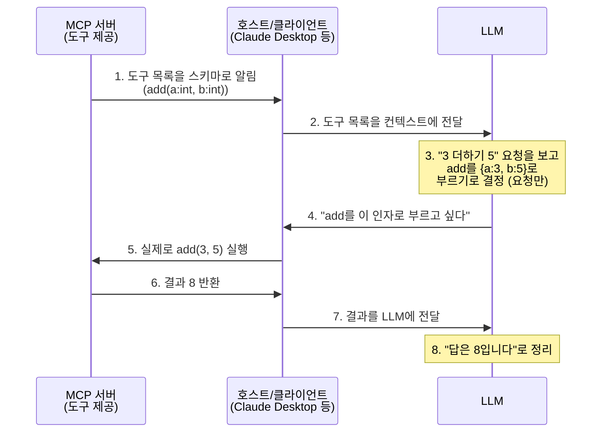

## 들어가며

한 면접에서 MCP 관련 질문을 받았지만 MCP에 대한 개념을 몰라서 답변을 못 했습니다.
"왜 나는 MCP를 잘 몰랐을까?"

이 글을 MCP에 대한 내용정리를 제가 이해한대로 정리한 글입니다.

## MCP란?

MCP는 Model Context Protocol의 약자로 도구 연결 방식을 통일하는 표준 프로토콜입니다.
각 API 또는 함수들은 제각각의 Payload를 가지고 있어 규격을 맞춰주지 않으면 error를 냅니다.
MCP는 이러한 제각각의 규격을 통일화하여 LLM이 요구사항을 토대로 필요한 도구를 선택하고, 서버는 그 도구를 실행해 결과를 반환합니다. 그 결과를 최종적으로 정리해서 답변으로 만드는 건 LLM의 역할입니다.

## 그러면 LLM은 서버가 어떤 도구를 가졌는지 어떻게 알까요?

MCP의 동작순서는 다음과 같습니다.



핵심은 각 단계의 **주체**에 있습니다.

1. **서버가 자기 도구를 설명합니다.**
   호스트가 서버에게 "어떤 도구를 가지고 있어?"라고 요청하면, 서버가 응답으로 도구 목록을 알려줍니다. "나 add라는 도구가 있고 정수 a, b를 받아"를 **JSON Schema** 형태로 응답합니다. (실제로는 초기화 단계에서 호스트가 tools/list 같은 요청을 보내고 서버가 응답하는 request-response 구조입니다.)
2. **호스트가 그 목록을 LLM에게 전달합니다.**
3. **LLM이 보고 판단합니다.** 도구 목록 중 `add`가 맞다고 보고
   `{a:3, b:5}`라는 payload를 만듭니다. — 단, 아무렇게나가 아니라
   **서버가 준 스키마에 맞춰서** 만듭니다.
4. **호스트가 실제로 호출하고, 결과를 받아 LLM에게 돌려줍니다.**

## 가장 중요한 구분 — LLM은 "결정"하고, 호스트가 "실행"한다

흔히 "LLM이 도구를 실행한다"고 말하지만, 정확히는 **LLM은 실행하지 않습니다.**

- LLM: "`add`를 `{a:3, b:5}`로 부르고 싶어" ← **결정(요청)만**
- 호스트: 실제로 `add(3, 5)` 호출 ← **실행**

LLM은 텍스트를 생성할 뿐 코드를 직접 돌릴 수 없습니다.
그래서 "실행"이라는 통제권이 호스트에 있다는 게 **보안의 핵심**이기도 합니다.
LLM이 어떤 도구든 부르고 싶다고 해도, 실제 실행 여부·권한·사람의 승인 지점을 통제하는 건 호스트입니다.

## 직접 만들어보기

FastMCP를 쓰면 도구 하나짜리 서버는 이 정도로 짧습니다.

```python
from mcp.server.fastmcp import FastMCP

mcp = FastMCP("my-first-server")

@mcp.tool()
def add(a: int, b: int) -> int:
    """두 정수를 더한다"""
    return a + b

if __name__ == "__main__":
    mcp.run()
```

FastAPI에서 `@app.get()`으로 엔드포인트를 만드는 것과 구조가 똑같습니다.
**MCP tool = LLM이 호출하는 함수**, 그게 전부입니다.

이 서버를 Claude Desktop 설정에 등록하고 "3 더하기 5 해줘"라고 치면,
Claude가 직접 계산하는 게 아니라 **내 서버의 `add`를 호출해서** 답합니다.
그 흐름을 눈으로 본 순간 MCP가 이해됩니다.

## 정리

MCP를 한번 정리해보았습니다.

각각의 Payload를 하나로 통일시킨건 MCP였고
LLM이 도구를 선택하지만 실행을 하지는 않습니다. 실제 실행 주체는 호스트입니다.

참고로 이 글에서는 tool 호출 중심으로 다뤘지만, MCP 스펙은 tools 외에도 resources(서버가 제공하는 데이터·파일)와 prompts(재사용 가능한 프롬프트 템플릿) 같은 개념도 포함하는 좀 더 넓은 프로토콜입니다. 다음에 MCP 질문 받으면 이 부분도 같이 언급하면 좋을 것 같습니다.

앞으로 면접이나 MCP에 대한 내용이 나오면 잘 답변할 수 있을 것 같습니다.