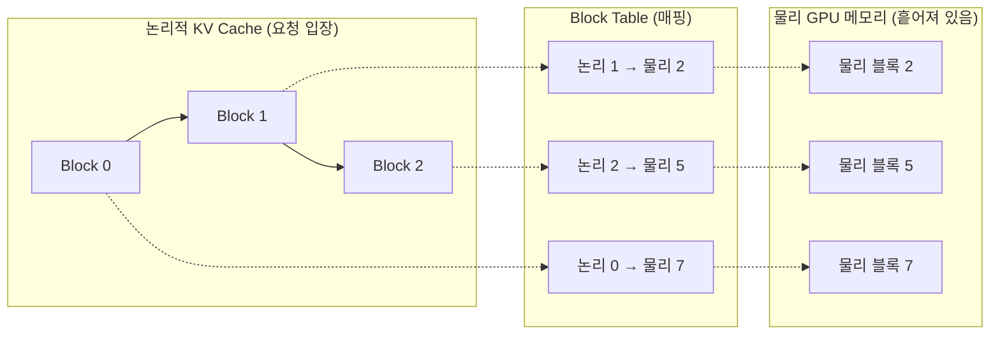

## 들어가며
GPU 한 장(A6000)에 모델을 여러 개 올려 서빙해본 적이 있습니다.
그때 계속 부딪힌 벽은 **메모리**였습니다.
동시 요청을 조금만 늘려도 GPU 메모리가 모자랐고,
"분명 여유가 있는 것 같은데 왜 배치를 못 키우지?"라는 생각이 들었습니다.

vLLM을 쓰면 같은 GPU에서 처리량이 크게 올라간다는 점은 경험으로 알고 있었습니다.
그런데 왜 기존 LLM 서빙보다 빠른지에 대한 답은 PagedAttention 논문에 있었습니다.[^paper]

한 줄로 요약하면 다음과 같습니다.

> KV cache를 **고정 크기 블록(page)으로 쪼개, 필요할 때마다 동적으로 할당**함으로써
> 메모리 낭비를 없애고 배치 크기(= 처리량)를 키운다.

이것이 제가 겪은 "메모리가 모자라 배치를 못 키우던" 문제의 정확한 해법이었습니다.

## Why — 기존 KV Cache 관리는 왜 메모리를 낭비했을까

먼저 KV cache를 보겠습니다.
LLM은 토큰을 하나씩 생성하면서, 앞서 계산한 key/value를 **KV cache**에 저장해 재사용합니다.
이 캐시는 요청마다 크고, 생성이 진행될수록 **동적으로 늘어납니다.**

문제는 기존 시스템이 이 캐시를 다루던 방식입니다.
요청 하나가 앞으로 쓸 수 있는 **최대 길이만큼 연속된 메모리를 미리 통째로 할당**합니다.

여기서 두 종류의 낭비가 생깁니다.

- **내부 단편화(internal fragmentation)** — 최대 길이로 예약했지만 실제 응답은
  훨씬 짧은 경우가 대부분입니다. 예약해놓고 안 쓰는 공간이 그대로 버려집니다.
- **외부 단편화(external fragmentation)** — 연속된 큰 공간이 필요하다 보니,
  여기저기 남은 자투리 공간을 합쳐도 쓰지 못합니다.

이 낭비의 결과가 핵심입니다.
**메모리가 낭비되니 한 번에 배치할 수 있는 요청 수가 줄고, 그만큼 처리량이 떨어진다.**
제가 A6000에서 "여유가 있어 보이는데 배치를 못 키우던" 상황이 바로 이거였습니다.

## How — OS의 페이징을 그대로 가져오다

PagedAttention의 아이디어는 새로 발명한 것이 아니라 **빌려온** 것입니다.
운영체제가 수십 년간 써온 **가상 메모리와 페이징**을 KV cache에 적용했습니다.

운영체제는 프로세스에게 "연속된 메모리를 쓰고 있다"는 착각을 주지만,
실제 물리 메모리에는 고정 크기 페이지들이 **흩어져** 있고,
페이지 테이블이 그 사이를 매핑합니다.

PagedAttention도 같은 방식으로 동작합니다.

- KV cache를 **고정 크기 블록**으로 쪼갭니다(블록 하나에 정해진 개수의 토큰이 들어감).
- 논리적으로는 연속이지만, **물리적으로는 흩어진 블록**에 매핑합니다.
- 요청이 토큰을 더 생성하면 블록을 **하나씩 더 붙이고**, 끝나면 회수합니다.

여기서 "고정"이라는 말을 정확히 나눠야 합니다.

- **블록의 크기는 고정** — 각 블록은 정해진 토큰 수를 넣습니다.
- **전체 할당량은 고정이 아니라 동적** — 필요한 만큼만 블록을 붙였다 회수합니다.

이 둘을 합치면, 최대 길이를 미리 예약할 필요가 사라집니다.
**실제 쓰는 만큼만 블록 단위로 할당하니 낭비가 거의 0에 수렴합니다.**

## 그래서 무슨 이득인가

낭비가 사라지면 같은 GPU 메모리에 **더 많은 요청을 담을 수 있습니다.**
배치 크기가 커지고, 그만큼 처리량이 올라갑니다.
논문은 기존 시스템(FasterTransformer, Orca) 대비 처리량이 **2~4배** 개선됐다고 보고합니다.
긴 시퀀스, 큰 모델, 복잡한 디코딩일수록 그 효과가 더 커집니다.

덤으로, 블록 단위로 관리하니 **여러 요청이 같은 블록을 공유**하는 것도 가능해집니다.

## 정리

- 기존 KV cache는 요청마다 **최대 길이만큼 연속 메모리를 미리 예약** → 단편화로 낭비 →
  배치 크기 제한 → 처리량 저하.
- PagedAttention은 KV cache를 **고정 크기 블록으로 쪼개 동적으로 할당·매핑**(OS 페이징 차용)
  → 낭비 제거 → 배치 확대 → 처리량 2~4배.
- 제가 A6000에서 겪은 "메모리가 모자라 동시 요청을 못 늘리던" 문제는,
  정확히 이 논문이 푸는 **단편화로 인한 배치 크기 제한**이었습니다.

[^paper]: Kwon et al., *Efficient Memory Management for Large Language Model Serving with PagedAttention*, SOSP 2023. <https://arxiv.org/abs/2309.06180>

---
